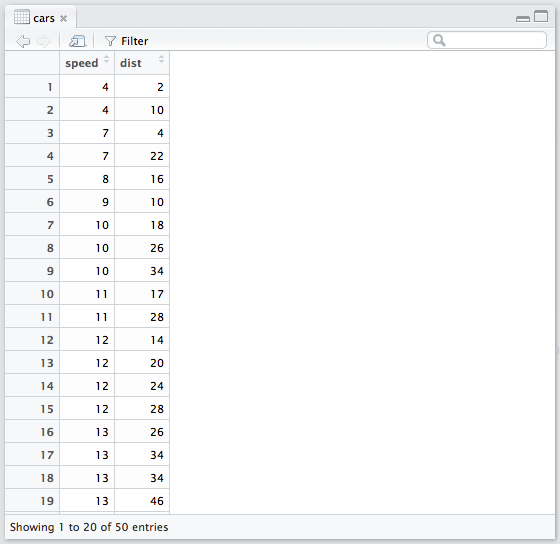
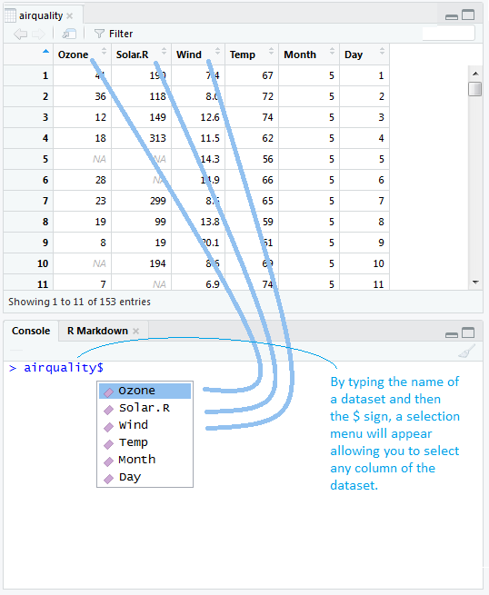
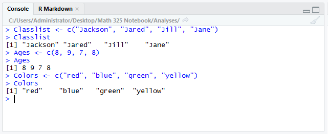
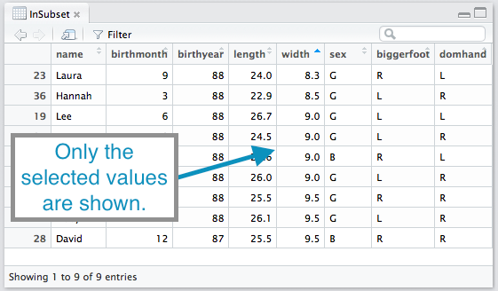
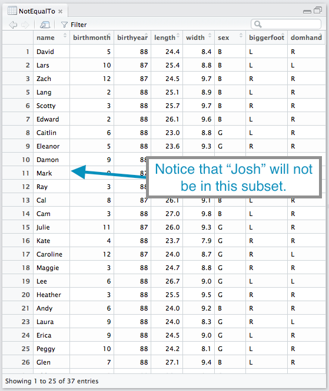
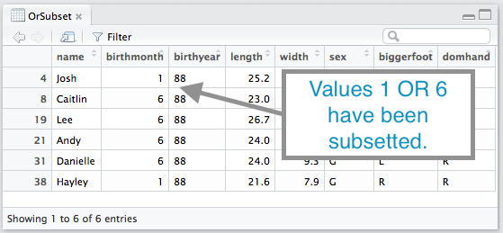
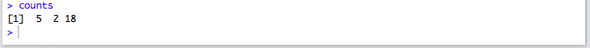
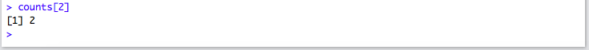
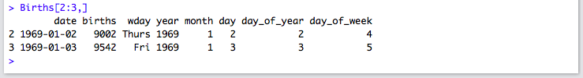

<script type="text/javascript">
 function showhide(id) {
    var e = document.getElementById(id);
    e.style.display = (e.style.display == 'block') ? 'none' : 'block';
 }
</script>


----

Open RStudio and try all the **Example** codes yourself.


## data( )

<div style="padding-left:15px;">

**Usage**

`data()`

* This command lists the available datasets in R.

**Examples**

<a href="javascript:showhide('DataOutput')">
<div class="hoverchunk">
<span class="tooltipr">
data
  <span class="tooltipRtext">An R function "data" used to bring up a list of available datasets in R.</span>
</span><span class="tooltipr">
()
  <span class="tooltipRtext">Functions always have parantheses following the function name. For this function we do not put anything inside the parantheses.</span>
</span><span class="tooltipr">
&nbsp;&nbsp;&nbsp;&nbsp;  
  <span class="tooltipRtext">Press Enter to run the code.</span>
</span><span class="tooltipr" style="float:right;">
&nbsp;...&nbsp; 
  <span class="tooltiprtext">Click to View Output.</span>
</span>
</div>
</a>
<div id="DataOutput" style="display:none;padding-left:20px;">


</div>


</div>
<br />
<hr />


## `?` The Help Command

<div style="padding-left:15px;">

**Usage**

`?something`

* This is the help command. It pulls up the help file for whatever you write in the place of `something`.

**Examples**

<a href="javascript:showhide('HelpOutput')">
<div class="hoverchunk">
<span class="tooltipr">
?
  <span class="tooltipRtext">The quick way to access the help function in R.</span>
</span><span class="tooltipr">
cars
  <span class="tooltipRtext">The name of a dataset can be typed to open the help file for that dataset.</span>
</span><span class="tooltipr">
&nbsp;&nbsp;&nbsp;&nbsp;  
  <span class="tooltipRtext">Press Enter to run the code.</span>
</span><span class="tooltipr" style="float:right;">
&nbsp;...&nbsp; 
  <span class="tooltiprtext">Click to View Output.</span>
</span>
</div>
</a>
<div id="HelpOutput" style="display:none;padding-left:20px;">


</div>


<a href="javascript:showhide('HelpOutput2')">
<div class="hoverchunk">
<span class="tooltipr">
?
  <span class="tooltipRtext">The quick way to access the help function in R.</span>
</span><span class="tooltipr">
View
  <span class="tooltipRtext">The name of an R function, like `View` can also be used to open the help file for that function.</span>
</span><span class="tooltipr">
&nbsp;&nbsp;&nbsp;&nbsp;  
  <span class="tooltipRtext">Press Enter to run the code.</span>
</span><span class="tooltipr" style="float:right;">
&nbsp;...&nbsp; 
  <span class="tooltiprtext">Click to View Output.</span>
</span>
</div>
</a>
<div id="HelpOutput2" style="display:none;padding-left:20px;">


</div>


</div>
<br />
<hr />


## View( ) {#view}

<div style="padding-left:15px;">
**Usage**

`View(object)`

* `object` is typically the name of a `data.frame` object in R, i.e., a dataset.

**Example Code**

<a href="javascript:showhide('CarsOutput')">
<div class="hoverchunk">
<span class="tooltipr">
View(
  <span class="tooltipRtext">An R function "View" allows us to view the datset that we select. This will open up a new tab in RStudio showing the dataset. Be sure to include the opening parantheses. </span>
</span><span class="tooltipr">
cars
  <span class="tooltipRtext">`cars` is data set that is in R. R has datasets that are available for anyone to use. You can see them using the `data()` command. It would be good to explore `View()` a few different datasets. </span>
</span><span class="tooltipr">
)
  <span class="tooltipRtext">Always be sure to end your function with closing parantheses. </span>
</span><span class="tooltipr">
&nbsp;&nbsp;&nbsp;&nbsp;  
  <span class="tooltipRtext">Press Enter to run the code.</span>
</span><span class="tooltipr" style="float:right;">
&nbsp;...&nbsp; 
  <span class="tooltiprtext">Click to View Output.</span>
</span>
</div>
</a>
<div id="CarsOutput" style="display:none;padding-left:20px;">


</div>


<a href="javascript:showhide('airqualityOutput1')">
<div class="hoverchunk">
<span class="tooltipr">
View(
  <span class="tooltipRtext"> Function can work with datasets but also combinations and matrices that you create. </span>
</span><span class="tooltipr">
airquality)
  <span class="tooltipRtext"> Gives us data concerning air quality measurements around New York City, NY. For more details on this dataset type: `?airquality`</span>
</span><span class="tooltipr">
&nbsp;&nbsp;&nbsp;&nbsp;  
  <span class="tooltipRtext">Press Enter to run the code.</span>
</span><span class="tooltipr" style="float:right;">
&nbsp;...&nbsp; 
  <span class="tooltiprtext">Click to View Output.</span>
</span>
</div>
</a>
<div id="airqualityOutput1" style="display:none;padding-left:20px;">

</div>

</div>

<br />
<hr />


## `$` The Selection Operator {#dollar}

<div style="padding-left:15px;">
`DataSetName$ColumnName`

* The `$` operator allows you to access the individual columns of a dataset.

**Example Code**


<a href="javascript:showhide('airqualityDollar')">
<div class="hoverchunk">
<span class="tooltipr">
airquality
  <span class="tooltipRtext">The `airqaulity` dataset. This could be the name of any dataset instead of `airquality`.</span>
  </span><span class="tooltipr">
$
  <span class="tooltipRtext"> Grabs the column, or variable, from the dataset to be used. This is typically used when computing say the mean (or other statistic) of a single column of the data. </span>
  </span><span class="tooltipr">
Ozone
  <span class="tooltipRtext"> The name of any column of the dataset can be entered after the dollar sign. In the airquality dataset, this includes: `Ozone`, `Solar.R`, `Wind`, `Temp`, `Month`, or `Day` as shown by `View(airquality)`. </span>
  </span><span class="tooltipr">
&nbsp;&nbsp;&nbsp;&nbsp;  
  <span class="tooltipRtext">Press Enter to run the code.</span>
  </span><span class="tooltipr" style="float:right;">
&nbsp;...&nbsp; 
  <span class="tooltiprtext">Click to View Output.</span>
</span>
</div>
</a>

<div id="airqualityDollar" style="display:none;padding-left:20px;">


</div>

</div>

<br />
<hr />


## `<-` The Assignment Operator {#assignment}

<div style="padding-left:15px;">
**Usage**

`NameYouCreate <- some R commands`

* `<-` (Less than symbol `<` with a hyphen `-`) is called the assignment operator and lets you store the results of the `some R commands` into an object called `NameYouCreate`.
* `NameYouCreate` is any name that begins with a letter, but can use numbers, periods, and underscores thereafter. The name should not contain spaces. 

**Example Code**

<a href="javascript:showhide('NamingCars1')">
<div class="hoverchunk">
<span class="tooltipr">
cars2
  <span class="tooltipRtext">First we name the object we are creating. In this case, we are making a copy of the cars dataset, so it is logical to call it `cars2`, but it could be `bob`, `c2` or any name you wanted to use. Just be careful to not use names that are already in use! </span>
 </span><span class="tooltipr">
&nbsp; <- &nbsp;
  <span class="tooltipRtext"> The `<-` assignment operator will take whatever is on the right hand side and save it into the name written on the left hand side. </span>
  </span><span class="tooltipr">
cars
  <span class="tooltipRtext">In this case the `cars` dataset is being copied to `cars2` so that we can change `cars2` without changing the original `cars` dataset.</span>
 </span><span class="tooltipr">
&nbsp;&nbsp;&nbsp;&nbsp;  
  <span class="tooltipRtext">Press Enter to run the code.</span>
  
</span><span class="tooltipr">
cars2
  <span class="tooltipRtext">The new copy of the `cars` dataset that we just created</span>
</span><span class="tooltipr">
\$ftpersec
  <span class="tooltipRtext">The `$` selection operator can be used to create a new column in a dataset when used with the `<-` assignment operator. </span>
</span><span class="tooltipr">
&nbsp;<-&nbsp;
  <span class="tooltipRtext">The `<-` assignment operator will take the results of the right-hand-side and save them into the name on the left-hand-side. </span>
</span><span class="tooltipr">
cars2$speed \* 5280 / 3600
  <span class="tooltipRtext">This calculation converts the miles per hour of the `cars2` `speed` column into feet per seconds because there are 5280 feet in a mile and 60 minutes in an hour and 60 seconds in a minute.</span>
</span>

</span><span class="tooltipr">
View(cars2)
  <span class="tooltipRtext">The `cars2` dataset now contains a 3rd column called `feetpersec`. Compare this to the original `cars` dataset to see how it changed.</span>
</span><span class="tooltipr" style="float:right;">
&nbsp;...&nbsp; 
  <span class="tooltiprtext">Click to View Output.</span>
</span>
</div>
</a>  

<div id="NamingCars1" style="display:none;padding-left:20px;">

</div>


</div>


<br />
<hr />


## c( ) The Concatenation Function {#cvector}

<div style="padding-left:15px;">
**Usage** 

`c(value 1, value 2, value 3, ... )`

* The `c( )` function combines `values` into a single object called a "vector". 
* `values 1, 2, 3, ...` can be numbers or characters, i.e., words, but must be all of one type or the other.

**Example Code**


<a href="javascript:showhide('cVector')">
<div class="hoverchunk">
<span class="tooltipr">
Classlist <- 
  <span class="tooltipRtext">`Classlist` is a new object being created using the assignment operator `<-` that will contain the four names listed above.</span>
 </span><span class="tooltipr">
&nbsp;c(
  <span class="tooltipRtext">The concatenate function `c( )` is being used in this case to group character values representing names of students into a single object named "Classlist".  </span>
  </span><span class="tooltipr">
"Jackson", "Jared", "Jill", "Jane")
  <span class="tooltipRtext"> These are the values we are grouping into the object named `Classlist`.  </span>
 </span><span class="tooltipr">
&nbsp;&nbsp;&nbsp;&nbsp;  
  <span class="tooltipRtext">Press Enter to run the code.</span>
</span>

<span class="tooltipr">
Ages <- &nbsp;
  <span class="tooltipRtext">The assignment operator `<-` is being used to create the object called `Ages` that will contain the ages of each student on the `Classlist`. </span>
 </span><span class="tooltipr">
c(
  <span class="tooltipRtext">The R function "c()" allows us to group together values in order to save them into an object. </span>
 </span><span class="tooltipr">
8, 9, 7, 8
  <span class="tooltipRtext"> The values, separated by comma's, that are being grouped together. In this case, numbers are being grouped together. </span>
  </span><span class="tooltipr">
) 
  <span class="tooltipRtext">Always close off your functions in R with a closing parathesis.</span>
 </span><span class="tooltipr">
&nbsp;&nbsp;&nbsp;&nbsp;  
  <span class="tooltipRtext">Press Enter to run the code.</span>
  
  
<span class="tooltipr">
Colors <- &nbsp;
  <span class="tooltipRtext">The assignment operator `<-` is being used to create the object called `Colors` that will have one color for each student on the `Classlist`. </span>
 </span><span class="tooltipr">
c(
  <span class="tooltipRtext">The R function "c()" allows us to group together values in order to save them into an object. </span>
 </span><span class="tooltipr">
"red", "blue", "green", "yellow"
  <span class="tooltipRtext"> The values, separated by comma's, that are being grouped together. In this case, characters are being grouped together. </span>
  </span><span class="tooltipr">
) 
  <span class="tooltipRtext">Always close off your functions in R with a closing parathesis.</span>
 </span><span class="tooltipr">
&nbsp;&nbsp;&nbsp;&nbsp;  
  <span class="tooltipRtext">Press Enter to run the code.</span>
  
  

</span>
</div>
</a> 

<div id="cVector" style="display:none;padding-left:20px;">

</div>

  
  

</div>
<br />
<hr />

## subset( ) {#subset}

<div style="padding-left:15px;">
**Usage** 

`subset(NameOfDataset, subsetRules, columnsToKeep)`

* `subset` is used to reduce a data set to a smaller set of rows than the original dataset contained.
* `NameOfDataset` is the name of a dataset, like `cars` or `airquality` or `KidsFeet`.
* `subsetRules` consists of some **Logical Expression** (see below) that selects only the rows from the original dataset that meet the criterion.
* The `columnsToKeep ` option is optional and usually excluded. However, it can be used to keep only certain columns of interest from the original dataset.


<div style="padding-left:30px;">
| **Logical Expression** | **Syntax** | 
|--------------------|--------|
| Equals (one value) | `==` |
| Equals (several values) | `%in%` |
| Not Equal | `!=` |
| Less Than | `<` |
| Less Then or Equal to | `<=` |
| Greater Than | `>` |
| Greater Than or Equal to | `>=` |
| AND | `&` | 
| OR | `|` |
</div>

**Example Code**

The original `KidsFeet` dataset looks like this prior to subsetting:

<div id="KidsFeet" style="display:show;padding-left:20px;">

</div>

<br/>

Here are ways to reduce this original `KidsFeet` dataset to filtered datasets.

*Keep only kids born in 1988*:

<a href="javascript:showhide('SubsetEqual')">
<div class="hoverchunk">
<span class="tooltipr">
Kids88 <-&nbsp;
  <span class="tooltipRtext">This provides a name for the new subset of the `KidsFeet` dataset that is going to be created by the `subset(...)` function. The results of the subset will be stored into this name by the assignment operator `<-`. </span>
</span><span class="tooltipr">
subset(
  <span class="tooltipRtext">An R function "subset" allows us to take our data and filter it with certain criteria. </span>
</span><span class="tooltipr">
KidsFeet,
  <span class="tooltipRtext"> Is the data we are filtering, in this case it is the data set "KidsFeet". The comma seperates the criteria. </span>
</span><span class="tooltipr">
&nbsp;birthyear
  <span class="tooltipRtext"> Represents the variable that we want to manipulate, it can be qualitative or quantitative. The variable "birthyear" reperesents the year the child was born in. </span>
</span><span class="tooltipr">
&nbsp;==
  <span class="tooltipRtext"> Represents "Equals To". The reason for the double equal sign will be explained later on.  </span>
  </span><span class="tooltipr">
&nbsp;88)
  <span class="tooltipRtext">  Is the criteria from the variable that we want. In this case it represents kids born in 1988. This can be qualitative or quantitive.</span>
</span><span class="tooltipr">
&nbsp;&nbsp;&nbsp;&nbsp;  
  <span class="tooltipRtext">Press Enter to run the code.</span>
</span><span class="tooltipr" style="float:right;">
&nbsp;...&nbsp; 
  <span class="tooltiprtext">Click to View Output.</span>
</span>
</div>
</a>
<div id="SubsetEqual" style="display:none;padding-left:20px;">

</div>

<br/>

*Keep only kids with specified foot widths*:

<a href="javascript:showhide('subsetIN')">
<div class="hoverchunk">
<span class="tooltipr">
KidsWide <-&nbsp;
  <span class="tooltipRtext">This provides a name for the new subset of the `KidsFeet` dataset that is going to be created by the `subset(...)` function. The results of the subset will be stored into this name by the assignment operator `<-`. </span>
</span><span class="tooltipr">
subset(KidsFeet,
  <span class="tooltipRtext">This was explained in the first example. </span>
</span><span class="tooltipr">
&nbsp;width
  <span class="tooltipRtext"> Represents the width of the widest foot of the child. When using the logic statement "In", the variable comes first. </span>
</span><span class="tooltipr">
&nbsp;%in%
  <span class="tooltipRtext"> Allows for specific values to be subsetted. The values can be qualitative or quantitative. </span>
  </span><span class="tooltipr">
 &nbsp;c(
  <span class="tooltipRtext">Recall that the "c()" command allows us to select certain values and combine them into a set or a group. In this case we select them to be subsetted.  </span>
</span><span class="tooltipr">
8.3,8.5,9.0,9.5))
  <span class="tooltipRtext"> Are the values that we are selecting, they will always be in list form, seperating each value by a comma. The entire function is closed with closing paratheses. </span>
</span><span class="tooltipr">
&nbsp;&nbsp;&nbsp;&nbsp;  
  <span class="tooltipRtext">Press Enter to run the code.</span>
</span><span class="tooltipr" style="float:right;">
&nbsp;...&nbsp; 
  <span class="tooltiprtext">Click to View Output.</span>
</span>
</div>
</a>

<div id="subsetIN" style="display:none;padding-left:20px;">

</div>

<br/>

*Keep only kids whose name is NOT Josh*:

<a href="javascript:showhide('SubsetNotEqual')">
<div class="hoverchunk">
<span class="tooltipr">
KidsNotJosh <-&nbsp;
  <span class="tooltipRtext">This provides a name for the new subset of the `KidsFeet` dataset that is going to be created by the `subset(...)` function. The results of the subset will be stored into this name by the assignment operator `<-`. </span>
</span><span class="tooltipr">
subset(
  <span class="tooltipRtext">An R function "subset" allows us to take our data and filter it with certain criteria. </span>
</span><span class="tooltipr">
KidsFeet,
  <span class="tooltipRtext">This part was explained in the first example </span>
</span><span class="tooltipr">
&nbsp;name
  <span class="tooltipRtext">Look at the first example. The variable "name" represents the names from which the data was collected.  </span>
</span><span class="tooltipr">
!
  <span class="tooltipRtext"> Represents not. It is saying everything but the criteria you give it. This can be a valuable symbol when dealing with outliers. </span>
</span><span class="tooltipr">
=
  <span class="tooltipRtext"> Represents equal, together with the "!", we are saying not equal. Notice again in the first example we had two equal signs, now you can see how having two allows for greater manipulation.  </span>
  </span><span class="tooltipr">
"
  <span class="tooltipRtext"> Are needed because the value is qualitative. </span>
</span><span class="tooltipr">
Josh")
  <span class="tooltipRtext"> Is the criteria from the variable that we do not want to include. In this case it is anyone named Josh. It is closed with ending quotations and closing paratheses. </span>
</span><span class="tooltipr">
&nbsp;&nbsp;&nbsp;&nbsp;  
  <span class="tooltipRtext">Press Enter to run the code.</span>
</span><span class="tooltipr" style="float:right;">
&nbsp;...&nbsp; 
  <span class="tooltiprtext">Click to View Output.</span>
</span>
</div>
</a>

<div id="SubsetNotEqual" style="display:none;padding-left:20px;">

</div>

<br/>

*Keep only kids with foot length less than 24*:

<a href="javascript:showhide('LessThan')">
<div class="hoverchunk">
<span class="tooltipr">
KidsLength24 <-&nbsp;
  <span class="tooltipRtext">This provides a name for the new subset of the `KidsFeet` dataset that is going to be created by the `subset(...)` function. The results of the subset will be stored into this name by the assignment operator `<-`. </span>
</span><span class="tooltipr">
subset(KidsFeet,
  <span class="tooltipRtext">This was explained in the first example. </span>
</span><span class="tooltipr">
&nbsp;length
  <span class="tooltipRtext"> Variable represents the length of the bigger size foot from each child. </span>
</span><span class="tooltipr">
&nbsp;<
  <span class="tooltipRtext"> Represents "Less Than" certain value. For this to work, the value must be quantitative. </span>
  </span><span class="tooltipr">
 &nbsp;24)
  <span class="tooltipRtext"> Is the quantitative value that we want less than of. In this case we want all children with foot length of less than 24cm.  </span>
</span><span class="tooltipr">
&nbsp;&nbsp;&nbsp;&nbsp;  
  <span class="tooltipRtext">Press Enter to run the code.</span>
</span><span class="tooltipr" style="float:right;">
&nbsp;...&nbsp; 
  <span class="tooltiprtext">Click to View Output.</span>
</span>
</div>
</a>

<div id="LessThan" style="display:none;padding-left:20px;">

</div>

<br/>

*Keep only kids whose foot less than or equal to 24*:

<a href="javascript:showhide('LessThanorEqualTo')">
<div class="hoverchunk">
<span class="tooltipr">
KidsLessEq24 <-&nbsp;
  <span class="tooltipRtext">This provides a name for the new subset of the `KidsFeet` dataset that is going to be created by the `subset(...)` function. The results of the subset will be stored into this name by the assignment operator `<-`. </span>
</span><span class="tooltipr">
subset(KidsFeet,
  <span class="tooltipRtext">This was explained in the first example. </span>
</span><span class="tooltipr">
&nbsp;length
  <span class="tooltipRtext"> Variable represents the length of the bigger size foot from each child. </span>
</span><span class="tooltipr">
&nbsp;<=
  <span class="tooltipRtext"> Represents "Less Than or Equal to" certain value. For this to work, the value must be quantitative. </span>
  </span><span class="tooltipr">
 &nbsp;24)
  <span class="tooltipRtext"> Is the quantitative value that we want our data to be equal to and less than. In this case we want all children with foot length of 24cm and below.  </span>
</span><span class="tooltipr">
&nbsp;&nbsp;&nbsp;&nbsp;  
  <span class="tooltipRtext">Press Enter to run the code.</span>
</span><span class="tooltipr" style="float:right;">
&nbsp;...&nbsp; 
  <span class="tooltiprtext">Click to View Output.</span>
</span>
</div>
</a>

<div id="LessThanorEqualTo" style="display:none;padding-left:20px;">

</div>

<br/>

*Keep only kids with foot wider than 9*:

<a href="javascript:showhide('GreaterThan')">
<div class="hoverchunk">
<span class="tooltipr">
KidsWider9 <-&nbsp;
  <span class="tooltipRtext">This provides a name for the new subset of the `KidsFeet` dataset that is going to be created by the `subset(...)` function. The results of the subset will be stored into this name by the assignment operator `<-`. </span>
</span><span class="tooltipr">
subset(KidsFeet,
  <span class="tooltipRtext">This was explained in the first example. </span>
</span><span class="tooltipr">
&nbsp;width
  <span class="tooltipRtext"> Variable represents the width of the wider foot from each child. </span>
</span><span class="tooltipr">
&nbsp;>
  <span class="tooltipRtext"> Represents "Greater Than" certain value. For this to work, the value must be quantitative. </span>
  </span><span class="tooltipr">
 &nbsp;9)
  <span class="tooltipRtext"> Is the quantitative value that we want our data to be greater than. In this case we want all children with foot width greater than 9cm. </span>
</span><span class="tooltipr">
&nbsp;&nbsp;&nbsp;&nbsp;  
  <span class="tooltipRtext">Press Enter to run the code.</span>
</span><span class="tooltipr" style="float:right;">
&nbsp;...&nbsp; 
  <span class="tooltiprtext">Click to View Output.</span>
</span>
</div>
</a>

<div id="GreaterThan" style="display:none;padding-left:20px;">

</div>

<br/>

*Keep only kids whose foot is equal to or wider than 9*:
<a href="javascript:showhide('GreaterThanorEqualTo')">
<div class="hoverchunk">
<span class="tooltipr">
KidsWiderEq9 <-&nbsp;
  <span class="tooltipRtext">This provides a name for the new subset of the `KidsFeet` dataset that is going to be created by the `subset(...)` function. The results of the subset will be stored into this name by the assignment operator `<-`. </span>
</span><span class="tooltipr">
subset(KidsFeet,
  <span class="tooltipRtext">This was explained in the first example. </span>
</span><span class="tooltipr">
&nbsp;width
  <span class="tooltipRtext"> Variable represents the width of the wider foot from each child. </span>
</span><span class="tooltipr">
&nbsp;>=
  <span class="tooltipRtext">  Represents "Greater Than or Equal To" certain value. For this to work, the value must be quantitative. </span>
  </span><span class="tooltipr">
 &nbsp;9)
  <span class="tooltipRtext">Is the quantitative value that we want our data to be greater than and equal to, in this case we want all children with foot width 9cm and above. </span>
</span><span class="tooltipr">
&nbsp;&nbsp;&nbsp;&nbsp;  
  <span class="tooltipRtext">Press Enter to run the code.</span>
</span><span class="tooltipr" style="float:right;">
&nbsp;...&nbsp; 
  <span class="tooltiprtext">Click to View Output.</span>
</span>
</div>
</a>

<div id="GreaterThanorEqualTo" style="display:none;padding-left:20px;">

</div>

<br/>

*Keep only girls with foot width greater than 9*:

<a href="javascript:showhide('And')">
<div class="hoverchunk">
<span class="tooltipr">
GirlsWide9 <-&nbsp;
  <span class="tooltipRtext">This provides a name for the new subset of the `KidsFeet` dataset that is going to be created by the `subset(...)` function. The results of the subset will be stored into this name by the assignment operator `<-`. </span>
</span><span class="tooltipr">
subset(KidsFeet,
  <span class="tooltipRtext">This was explained in the first example. </span>
</span><span class="tooltipr">
&nbsp;sex=="G"
  <span class="tooltipRtext"> Variable "sex" represents the first criteria. We only want girls, represented by "G", so we write "==". </span>
</span><span class="tooltipr">
&nbsp;&
  <span class="tooltipRtext"> Represents the logic statement "And". It is used when you want to subset from two or more seperate variables. It can be used with qualitative and quantitative data. In this case, we are specifying girls that have foot width greater than 9cm.  </span>
  </span><span class="tooltipr">
 &nbsp;width > 9)
  <span class="tooltipRtext"> Represents the second criteria. We want any foot width that is greater than 9. </span>
</span><span class="tooltipr">
&nbsp;&nbsp;&nbsp;&nbsp;  
  <span class="tooltipRtext">Press Enter to run the code.</span>
</span><span class="tooltipr" style="float:right;">
&nbsp;...&nbsp; 
  <span class="tooltiprtext">Click to View Output.</span>
</span>
</div>
</a>

<div id="And" style="display:none;padding-left:20px;">

</div>

<br/>

*Keep only kids born in months 1 or 6*:

<a href="javascript:showhide('Or')">
<div class="hoverchunk">
<span class="tooltipr">
KidsJanJune <-&nbsp;
  <span class="tooltipRtext">This provides a name for the new subset of the `KidsFeet` dataset that is going to be created by the `subset(...)` function. The results of the subset will be stored into this name by the assignment operator `<-`. </span>
</span><span class="tooltipr">
subset(KidsFeet,
  <span class="tooltipRtext">This was explained in the first example. </span>
</span><span class="tooltipr">
&nbsp;birthmonth == 1
  <span class="tooltipRtext"> Variable "birthmonth" represents the first criteria. We want to look at children born in January. </span>
</span><span class="tooltipr">
&nbsp;|
  <span class="tooltipRtext"> Represents the logic statement "Or". It is used when you want to subset two or more criteria from the same variable. It can be used with qualitative or quantitative data. In this case, we are specifying we want children born in January or June. </span>
  </span><span class="tooltipr">
 &nbsp;birthmonth == 6)
  <span class="tooltipRtext"> Is the second criteria. We want to look at children that are born in June. </span>
</span><span class="tooltipr">
&nbsp;&nbsp;&nbsp;&nbsp;  
  <span class="tooltipRtext">Press Enter to run the code.</span>
</span><span class="tooltipr" style="float:right;">
&nbsp;...&nbsp; 
  <span class="tooltiprtext">Click to View Output.</span>
</span>
</div>
</a>

<div id="Or" style="display:none;padding-left:20px;">


</div>


</div>
<br />
<hr />


### `[ ]` Manual Subsetting Brackets {#brackets}

<div style="padding-left:15px;">
**Console** Help Command: `none`

`objectName[ elementNumber ]`

`objectName[ Rows, Columns]` 

* If `objectName` is an object that contains a list of numbers then `[ elementNumber ]` will pull out the specified elements.
* If `objectName` is an object with rows and columns (like a dataset) then the specified `[ Rows , Columns]` can be accessed.

**Example Code**


  <a href="javascript:showhide('ElementExample')">
<div class="hoverchunk">
 </span><span class="tooltipr">
## Run these commands in your console to see how they work. 
  <span class="tooltipRtext"></span>
  

<span class="tooltipr">
counts <- c(5, 2, 18)
  <span class="tooltipRtext">Run this command in your console</span>
  </span><span class="tooltipr">
&nbsp;&nbsp;&nbsp;&nbsp;  
  <span class="tooltipRtext">Press Enter to run the code.</span>
  
  
 </span><span class="tooltipr">
 counts
  <span class="tooltipRtext">Run this command in your console to see the values.  </span>
  </span><span class="tooltipr">
&nbsp;&nbsp;&nbsp;&nbsp;  
  <span class="tooltipRtext">Press Enter to run the code.</span>
  </span><span class="tooltipr" style="float:right;">
&nbsp;...&nbsp; 
  <span class="tooltiprtext">Click to View Output.</span>
  
  
</span>
</div>
</a> 
  
<div id="ElementExample" style="display:none;padding-left:20px;">



</div>
  
  
<a href="javascript:showhide('ElementExample1')">
<div class="hoverchunk">
  </span><span class="tooltipr">
counts
  <span class="tooltipRtext">First, state the object that will be accessed. </span>
    </span><span class="tooltipr">
[
  <span class="tooltipRtext">Opening brackets to allow for the command to be started. </span>
  </span><span class="tooltipr">
2
  <span class="tooltipRtext"> Is the element number because it is a list of numbers. </span>
  </span><span class="tooltipr">
]
  <span class="tooltipRtext">Closing brackets allow for the command to end. </span>
 </span><span class="tooltipr">
&nbsp;&nbsp;&nbsp;&nbsp;  
  <span class="tooltipRtext">Press Enter to run the code.</span>
  </span><span class="tooltipr" style="float:right;">
&nbsp;...&nbsp; 
  <span class="tooltiprtext">Click to View Output.</span>
  
</span>
</div>
</a> 
  
<div id="ElementExample1" style="display:none;padding-left:20px;">

  
  
 </div> 
  
  <a href="javascript:showhide('ElementExample2')">
<div class="hoverchunk">
  </span><span class="tooltipr">
counts[
  <span class="tooltipRtext">This was explained in the first example. </span>
    </span><span class="tooltipr">
2:3]
  <span class="tooltipRtext">Represents between. In this case, we want element numbers 2 and 3. </span>
 </span><span class="tooltipr">
&nbsp;&nbsp;&nbsp;&nbsp;  
  <span class="tooltipRtext">Press Enter to run the code.</span>
  </span><span class="tooltipr" style="float:right;">
&nbsp;...&nbsp; 
  <span class="tooltiprtext">Click to View Output.</span>
  
</span>
</div>
</a>
  
  
<div id="ElementExample2" style="display:none;padding-left:20px;">
  
  
  
  
  
</div>

<a href="javascript:showhide('ElementExample3')">
<div class="hoverchunk">
  </span><span class="tooltipr">
counts[
  <span class="tooltipRtext">This was explained in the first example. </span>
    </span><span class="tooltipr">
c(
  <span class="tooltipRtext">Recall that the "c()" function groups together values.  </span>
  </span><span class="tooltipr">
1,3
  <span class="tooltipRtext"> Represents the specific element numbers. </span>
  </span><span class="tooltipr">
)]
  <span class="tooltipRtext">Be sure to close off with the needed parantheses and brackets. </span>
 </span><span class="tooltipr">
&nbsp;&nbsp;&nbsp;&nbsp;  
  <span class="tooltipRtext">Press Enter to run the code.</span>
  </span><span class="tooltipr" style="float:right;">
&nbsp;...&nbsp; 
  <span class="tooltiprtext">Click to View Output.</span>
  
</span>
</div>
</a>
  
<div id="ElementExample3" style="display:none;padding-left:20px;">

  
</div>


  <a href="javascript:showhide('ViewBirths')">
  <div class="hoverchunk">
  </span><span class="tooltipr">
View(Births)
  <span class="tooltipRtext">Run this code in your console to view the R dataset "Births".       </span>
  </span><span class="tooltipr" style="float:right;">
&nbsp;...&nbsp; 
  <span class="tooltiprtext">Click to View Output.</span>
  
</span>
</div>
</a>  

<div id="ViewBirths" style="display:none;padding-left:20px;">


</div>


  <a href="javascript:showhide('BirthsACol')">
  <div class="hoverchunk">
  </span><span class="tooltipr">
Births[
  <span class="tooltipRtext"> Is a datset instead of a list of numbers, we treat this differently. </span>
  </span><span class="tooltipr">
2:3, 
  <span class="tooltipRtext"> Values before the comma represent the dataset rows. In this case, we are saying we want rows between 2 and 3. </span>
  </span><span class="tooltipr">
&nbsp; 
  <span class="tooltipRtext"> Values after the comma represent the dataset columns. A blank value represents all columns.</span>
  </span><span class="tooltipr">
]
  <span class="tooltipRtext">Closed with closing brackets. </span>
  </span><span class="tooltipr">
&nbsp;&nbsp;&nbsp;&nbsp;  
  <span class="tooltipRtext">Press Enter to run the code. </span>
  </span><span class="tooltipr" style="float:right;">
&nbsp;...&nbsp; 
  <span class="tooltiprtext">Click to View Output.</span>
 
 
</span>
</div>
</a> 

<div id="BirthsACol" style="display:none;padding-left:20px;">



</div>


  <a href="javascript:showhide('BirthARow')">
  <div class="hoverchunk">
  </span><span class="tooltipr">
Births[
  <span class="tooltipRtext">This was explained in the first example using the Births dataset.   </span>
  </span><span class="tooltipr">
&nbsp;
  <span class="tooltipRtext"> Blank value represents all rows.  </span>
  </span><span class="tooltipr">
,1]
  <span class="tooltipRtext"> Values after the comma represent the dataset columns. In this case, it is the 1st column. </span>
 </span><span class="tooltipr">
&nbsp;&nbsp;&nbsp;&nbsp;  
  <span class="tooltipRtext">Press Enter to run the code. </span>
  </span><span class="tooltipr" style="float:right;">
&nbsp;...&nbsp; 
  <span class="tooltiprtext">Click to View Output.</span>
  
</span>
</div>
</a>  

<div id="BirthARow" style="display:none;padding-left:20px;">


</div>


  <a href="javascript:showhide('BirthsRowCol')">
  <div class="hoverchunk">
  </span><span class="tooltipr">
Births[
  <span class="tooltipRtext">This was explained in the first example using the Births dataset.  </span>
  </span><span class="tooltipr">
5,2]
  <span class="tooltipRtext"> Represents the 5th row and the 2nd column. When both values are present, it will result in a single value. </span>
 </span><span class="tooltipr">
&nbsp;&nbsp;&nbsp;&nbsp;  
  <span class="tooltipRtext">Press Enter to run the code.</span>
  </span><span class="tooltipr" style="float:right;">
&nbsp;...&nbsp; 
  <span class="tooltiprtext">Click to View Output.</span>
  
  
</span>
</div>
</a> 

<div id="BirthsRowCol" style="display:none;padding-left:20px;">


</div>


  <a href="javascript:showhide('BirthsRowsCol')">
  <div class="hoverchunk">
  </span><span class="tooltipr">
Births[
  <span class="tooltipRtext">This was explained in the first example using the Births dataset. </span>
    </span><span class="tooltipr">
2:3,
  <span class="tooltipRtext"> Represents rows between 2 and 3. The comma seperates the rows and columns. The output will show row number 2 value first and then row number 3 value.  </span>
    </span><span class="tooltipr">
2]
  <span class="tooltipRtext"> Represents the column number. </span>
 </span><span class="tooltipr">
&nbsp;&nbsp;&nbsp;&nbsp;  
  <span class="tooltipRtext">Press Enter to run the code.</span>
  </span><span class="tooltipr" style="float:right;">
&nbsp;...&nbsp; 
  <span class="tooltiprtext">Click to View Output.</span>
  
  
</span>
</div>
</a>

<div id="BirthsRowsCol" style="display:none;padding-left:20px;">


</div>

</div>
<br />
<hr />


## with( ) {#with}

<div style="padding-left:15px;">
**Console** Help Command: `?with`

`with(datasetName, commands)`

* This function allows you to not have to use `$` to access the columns of a dataset. It is useful sometimes, but not always.
* `datasetName` is the name of a dataset like `cars` or `CO2`.
* `commands` are any R Commands that need to be performed using the variables within the specified dataset.

**Example Code**

<a href="javascript:showhide('WithCarsMean')">
<div class="hoverchunk">
<span class="tooltipr">
with(
  <span class="tooltipRtext">The R function "with" says that any command after this will be used using the selected dataset. </span>
</span><span class="tooltipr">
cars,
  <span class="tooltipRtext">Immediatly after the opening paratheses we state the datset that we want our commands to use. </span>
  </span><span class="tooltipr">
&nbsp;mean(
  <span class="tooltipRtext"> Is the command that we want to use with our dataset. It doesn't necessarily have to be "mean" but can be a wide range of commands. </span>
</span><span class="tooltipr">
dist))
  <span class="tooltipRtext"> Is the variable from our dataset that we want our command to use. It is closed off with closing parantheses. </span>
</span><span class="tooltipr">
&nbsp;&nbsp;&nbsp;&nbsp;  
  <span class="tooltipRtext">Press Enter to run the code.</span>
  </span><span class="tooltipr" style="float:right;">
&nbsp;...&nbsp; 
  <span class="tooltiprtext">Click to View Output.</span>
  
</span>
</div>
</a> 
  
  <div id="WithCarsMean" style="display:none;padding-left:20px;">
  
  
```{r, echo=FALSE}
with(cars, mean(dist))
```

</div>

<a href="javascript:showhide('WithCarsCor')">
<div class="hoverchunk">
<span class="tooltipr">
with(cars, 
  <span class="tooltipRtext">This was explained in the first example.</span>
</span><span class="tooltipr">
&nbsp;cor( 
  <span class="tooltipRtext"> Gives us the correlation coefficient. As previously stated, it doesn't have to be correlation command.  </span>
  </span><span class="tooltipr">
dist, 
  <span class="tooltipRtext"> Is the first variable from the cars dataset to be used for the correlation command. </span>
</span><span class="tooltipr">
&nbsp;speed))
  <span class="tooltipRtext"> Is the second variable from the cars dataset to be used for the correlation command. It is closed off with closing parantheses. </span>
</span><span class="tooltipr">
&nbsp;&nbsp;&nbsp;&nbsp;  
  <span class="tooltipRtext">Press Enter to run the code.</span>
  </span><span class="tooltipr" style="float:right;">
&nbsp;...&nbsp; 
  <span class="tooltiprtext">Click to View Output.</span>
  
</span>
</div>
</a> 
  
  <div id="WithCarsCor" style="display:none;padding-left:20px;">
  
```{r, echo=FALSE}
with(cars,cor(dist,speed))
```

</div>

</div>
<br />
<hr />


<!--

### ... {#}

<div style="padding-left:15px;">
**Console** Help Command: `?`

`()`

* 

**Example Code**

```{r, eval=FALSE, comment=NA}
...
```

</div>
<br />
<hr />


<br />
<br />
<br />


-->

</div>

</div>

----

<br/>
 

<footer></footer>